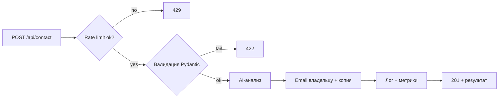
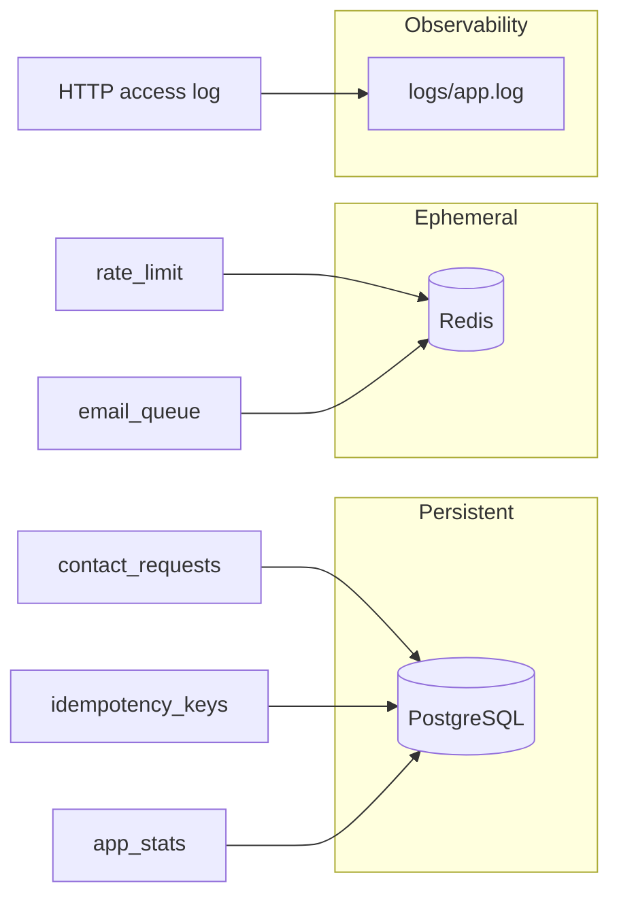

# Landing Contact Service

Backend-сервис для лендинг-презентации разработчика: REST API формы обратной связи с
валидацией, email-уведомлениями, rate limiting, файловым логированием, метриками и
AI-анализом обращений (тональность, классификация, авто-ответ) с graceful fallback.

Стек: **Python 3.11 + FastAPI + PostgreSQL + Redis**.

**Репозиторий:** после `git push` укажите URL здесь, напр. `https://github.com/<username>/landing-contact`

**Live demo** (после деплоя через [`render.yaml`](render.yaml) → Render Blueprint):
- Landing: https://landing-contact.onrender.com/
- Health: https://landing-contact.onrender.com/api/health
- Metrics: https://landing-contact.onrender.com/api/metrics

---

## 1. Как запустить проект

### Требования
- Python 3.9+ (рекомендуется 3.11)
- pip
- PostgreSQL 15+ (локально) **или** Docker / Docker Compose

### Установка и запуск (локально)
```bash
# 1. Клонировать репозиторий и перейти в папку
cd "test task"

# 2. Создать и активировать виртуальное окружение
python -m venv .venv
source .venv/bin/activate          # Windows: .venv\Scripts\activate

# 3. Установить зависимости
pip install -r requirements.txt

# 4. Настроить переменные окружения
cp .env.example .env               # затем отредактируйте .env

# 5. Запустить PostgreSQL (если нет своей установки на :5432)
docker compose up postgres -d
# дождитесь STATUS: healthy → docker compose ps postgres

# 6. Применить миграции БД
alembic upgrade head

# 7. Запустить сервер
uvicorn app.main:app --reload
```

> **Redis не обязателен** для локального запуска: при пустом `REDIS_URL` rate limit
> работает через файл, email - через BackgroundTasks.

После запуска:
- Лендинг: http://localhost:8000/
- Swagger UI: http://localhost:8000/docs (отключён при `APP_ENV=production`)
- ReDoc: http://localhost:8000/redoc
- OpenAPI spec: http://localhost:8000/openapi.json
- Health: http://localhost:8000/api/health

Экспорт OpenAPI для Postman/Insomnia:
```bash
curl -s http://localhost:8000/openapi.json -o openapi.json
```

> **Production:** задайте `APP_ENV=production`, явный whitelist в `CORS_ORIGINS`
> (значение `*` запрещено валидатором), обязательный `DATABASE_URL`.
> Секреты - через env vars платформы (Render/Railway), `.env` - только для локальной разработки.

### Запуск через Docker
```bash
docker build -t landing-contact .
docker run -p 8000:8000 --env-file .env landing-contact
```

### Запуск через Docker Compose (app + Redis + ARQ worker)
```bash
docker compose up --build
```

### Ограничения файлового rate limit
- **Один worker** (`uvicorn app.main:app`) — файловый rate limit работает корректно.
- **Несколько workers** (`--workers N`) или **несколько инстансов** - используйте `REDIS_URL` для shared rate limiting (см. ниже).

### Настройка переменных окружения (`.env`)
| Переменная | Назначение | По умолчанию |
|---|---|---|
| `APP_ENV` | `development`, `staging` или `production` | `development` |
| `LOG_FORMAT` | `text` или `json` (structured logging) | `text` |
| `LOG_LEVEL` | Уровень логирования (`DEBUG`, `INFO`, …) | `INFO` |
| `TRUSTED_PROXY_IPS` | IP прокси, которым доверяем `X-Forwarded-For` | — |
| `CORS_ORIGINS` | Разрешённые origin через запятую (`*` — все; в production запрещено) | `*` |
| `CORS_ALLOW_CREDENTIALS` | Разрешить credentials (авто-отключается при `CORS_ORIGINS=*`) | `true` |
| `RATE_LIMIT_MAX_REQUESTS` | Лимит запросов с одного IP | `5` |
| `RATE_LIMIT_WINDOW_SECONDS` | Окно лимита IP (сек) | `60` |
| `RATE_LIMIT_EMAIL_MAX` | Лимит запросов с одного email | `3` |
| `RATE_LIMIT_EMAIL_WINDOW` | Окно лимита email (сек) | `3600` |
| `DEFAULT_PHONE_REGION` | Регион парсинга телефона | `RU` |
| `DATABASE_URL` | PostgreSQL connection string (asyncpg) | см. `.env.example` |
| `DB_POOL_SIZE` / `DB_ECHO` | Пул соединений / SQL-лог SQLAlchemy | `5` / `false` |
| `REDIS_URL` | Redis для rate limit + ARQ email queue | — |
| `SMTP_HOST` / `SMTP_PORT` | SMTP-сервер (пусто → fallback в лог) | — / `587` |
| `SMTP_USERNAME` / `SMTP_PASSWORD` | Учётные данные SMTP | — |
| `SMTP_USE_TLS` | Использовать STARTTLS | `true` |
| `SMTP_FROM` | Отправитель писем | — |
| `OWNER_EMAIL` | Email владельца сайта | — |
| `AI_PROVIDER` | `openai` или `anthropic` | `openai` |
| `AI_TIMEOUT_SECONDS` | Таймаут вызова AI | `15` |
| `AI_CIRCUIT_FAILURE_THRESHOLD` | Ошибок до открытия circuit breaker | `3` |
| `AI_CIRCUIT_COOLDOWN_SECONDS` | Пауза circuit breaker (сек) | `300` |
| `OPENAI_API_KEY` / `OPENAI_MODEL` | Ключ и модель OpenAI | — / `gpt-4o-mini` |
| `ANTHROPIC_API_KEY` / `ANTHROPIC_MODEL` | Ключ и модель Anthropic | — / `claude-3-5-haiku-latest` |
| `TURNSTILE_SITE_KEY` / `TURNSTILE_SECRET_KEY` | Cloudflare Turnstile CAPTCHA | — |

> Сервис работает даже без AI-ключа и без SMTP: включается graceful fallback.

---

## 2. Стек технологий

### Backend
- **Язык:** Python 3.11
- **Фреймворк:** FastAPI + Uvicorn
- **Валидация и конфиг:** Pydantic v2, pydantic-settings, email-validator, phonenumbers
- **БД:** PostgreSQL, SQLAlchemy 2.0 (async), asyncpg, Alembic
- **Кэш/очереди:** Redis, ARQ
- **CAPTCHA:** Cloudflare Turnstile (опционально)

### AI
- **Провайдеры:** OpenAI (`gpt-4o-mini`) / Anthropic (`claude-3-5-haiku-latest`)
- **Паттерны:** Strategy (выбор провайдера), Circuit Breaker, Graceful Degradation

### Инфраструктура
- **Логирование:** RotatingFileHandler + stdout, text/json, `LOG_LEVEL`, correlation id
- **Безопасность:** CORS whitelist, production-валидация Settings, маскирование DATABASE_URL в логах
- **Observability:** health probes (AI/SMTP/PostgreSQL/Redis), typed OpenAPI schemas, `X-Request-ID`
- **Rate limiting:** dual-key (IP + email), Redis или файловый fallback
- **Idempotency:** заголовок `Idempotency-Key` для дедупликации POST

---

## 3. Архитектура

Слоистая архитектура **Controllers → Services → Repositories**:

```
app/
├─ main.py                  # инициализация FastAPI, CORS, middleware, error handlers
├─ core/
│  ├─ config.py             # настройки из .env (Settings + production validator)
│  ├─ logging.py            # логирование в файл + консоль (LOG_LEVEL, json/text)
│  ├─ exceptions.py         # доменные исключения + глобальные обработчики
│  ├─ context.py            # contextvars для request_id
│  └─ circuit_breaker.py    # circuit breaker для AI
├─ api/                     # Controllers (роутеры)
│  ├─ routes_contact.py     # POST /api/contact, GET /api/config/public
│  ├─ routes_health.py      # GET  /api/health
│  └─ routes_metrics.py     # GET  /api/metrics
├─ schemas/                 # Pydantic-модели (валидация, сериализация)
│  ├─ contact.py
│  └─ system.py             # HealthResponse, MetricsResponse, PublicConfigResponse
├─ services/                # Бизнес-логика
│  ├─ contact_service.py    # оркестрация полного цикла
│  ├─ ai_service.py         # AI + fallback
│  ├─ email_service.py      # SMTP + fallback
│  └─ prompts.py            # промпты AI
├─ repositories/            # Доступ к данным (PostgreSQL / Redis)
│  ├─ contact_repository.py
│  ├─ idempotency_repository.py
│  ├─ metrics_repository.py
│  └─ rate_limit_repository.py  # dev-fallback; prod → Redis
├─ db/
│  ├─ session.py
│  └─ models/
└─ middleware/
   └─ request_logging.py    # логирование каждого запроса
```

**Паттерны:** слоистая архитектура, Repository (изоляция хранения), Dependency Injection
(сервисы принимают зависимости в конструкторе - удобно для тестов), Strategy
(AI-провайдер выбирается по конфигу), Graceful Degradation (fallback для AI и email).

**Почему FastAPI:** автогенерируемая OpenAPI/Swagger-документация, декларативная валидация
через Pydantic, нативный async (важно для внешних AI/SMTP вызовов), минимум boilerplate.

**Почему PostgreSQL:** надёжное ACID-хранилище для обращений, idempotency и метрик;
SQL-агрегации вместо counter-файлов; Alembic для версионирования схемы.

> Подробное обоснование всех ключевых решений - в [разделе 8](#8-архитектурные-решения-и-обоснование).

### Инфраструктурные улучшения (production-ready)

| Область | Что улучшено |
|---|---|
| **CORS** | Whitelist methods/headers; `credentials=False` при `origins=*`; env `CORS_ALLOW_CREDENTIALS` |
| **Ошибки** | `request_id` + `X-Request-ID` во всех error responses; `IntegrityError` → 409; 404 → `error: not_found` |
| **Config** | `APP_ENV` enum; fail-fast в production (запрет `CORS=*`, обязательный `DATABASE_URL`); маскирование пароля БД в логах |
| **OpenAPI** | Typed schemas для `/health`, `/metrics`, `/config/public`; examples для 201/400/422/429/500; `/docs` отключён в production |
| **Logging** | Env `LOG_LEVEL`; подавление шума SQLAlchemy при `DB_ECHO=false` |
| **Тесты** | `tests/test_error_handlers.py` - формат ошибок, CORS, production validation |

Полный цикл запроса: `валидация → rate limit (IP+email) → captcha → idempotency → save → AI → email queue → ответ`.

Заголовки ответа `POST /api/contact`:
- `X-RateLimit-Limit`, `X-RateLimit-Remaining` - на успешных ответах
- `Retry-After`, `X-RateLimit-Remaining: 0` - при 429
- `X-Request-ID` - correlation id на всех запросах
- `Idempotency-Key` - опциональный заголовок запроса для дедупликации



---

## 4. Реализация API

### `POST /api/contact`
Приём обращения с формы.

Запрос:
```json
{
  "name": "Иван Петров",
  "email": "ivan@example.com",
  "phone": "+7 999 123-45-67",
  "comment": "Здравствуйте! Хотел бы обсудить проект."
}
```

Успех - `201 Created`:
```json
{
  "success": true,
  "message": "Спасибо! Ваше обращение принято.",
  "request_id": "a1b2c3d4e5f6",
  "received_at": "2026-07-16T12:00:00Z",
  "analysis": {
    "sentiment": "positive",
    "category": "project_inquiry",
    "auto_reply": "Здравствуйте, Иван Петров! Спасибо за обращение...",
    "summary": "Интересуется разработкой проекта",
    "ai_used": true,
    "provider": "openai"
  },
  "email_owner_sent": null,
  "email_user_sent": null,
  "email_queued": true
}
```

Email отправляется асинхронно (BackgroundTasks или ARQ worker). Поля `email_*_sent` будут `null` при `email_queued: true`.

Ошибка валидации - `422`:
```json
{
  "success": false,
  "error": "validation_error",
  "message": "Request validation failed",
  "status": 422,
  "request_id": "a1b2c3d4e5f6",
  "detail": [
    { "field": "email", "message": "value is not a valid email address", "type": "value_error" }
  ]
}
```

Rate limit - `429` (+ заголовки `Retry-After`, `X-RateLimit-*`):
```json
{
  "success": false,
  "error": "rate_limit_exceeded",
  "message": "Too many requests. Please try again later.",
  "status": 429,
  "request_id": "a1b2c3d4e5f6"
}
```

CAPTCHA failed - `400`:
```json
{
  "success": false,
  "error": "captcha_failed",
  "message": "CAPTCHA verification failed",
  "status": 400,
  "request_id": "a1b2c3d4e5f6"
}
```

Конфликт БД (duplicate) - `409`:
```json
{
  "success": false,
  "error": "conflict",
  "message": "Resource conflict (duplicate or constraint violation)",
  "status": 409,
  "request_id": "a1b2c3d4e5f6"
}
```

Внутренняя ошибка - `500` (детали только в логах, не клиенту):
```json
{
  "success": false,
  "error": "internal_error",
  "message": "Internal server error",
  "status": 500,
  "request_id": "a1b2c3d4e5f6"
}
```

### `GET /api/config/public`
Публичная конфигурация для фронтенда (Turnstile site key).

Ответ `200`:
```json
{
  "turnstile_site_key": "0x4AAAAAAA...",
  "turnstile_enabled": true
}
```

### `GET /api/health`
Статус сервиса и probes: AI, SMTP, PostgreSQL, Redis.

Ответ `200` (ok):
```json
{
  "status": "ok",
  "version": "1.0.0",
  "time": "2026-07-16T12:00:00Z",
  "ai_provider": "openai",
  "ai_configured": false,
  "smtp_configured": false,
  "checks": {
    "ai": { "status": "ok", "detail": "not configured (fallback mode)" },
    "smtp": { "status": "ok", "detail": "not configured (fallback mode)" },
    "postgres": { "status": "ok", "detail": "connection successful" },
    "redis": { "status": "ok", "detail": "not configured" }
  }
}
```

При недоступности зависимостей - `"status": "degraded"`, проблемный check с `"status": "error"`.

### `GET /api/metrics`
Агрегированная статистика из PostgreSQL.

Ответ `200`:
```json
{
  "total_requests": 42,
  "emails_sent_owner": 0,
  "emails_sent_user": 0,
  "emails_queued": 2,
  "ai_used": 30,
  "ai_fallback": 12,
  "ai_circuit_open_count": 0,
  "by_sentiment": { "positive": 20, "neutral": 15, "negative": 7 },
  "by_category": { "project_inquiry": 25, "job_offer": 10, "other": 7 },
  "first_request_at": "2026-07-01T10:00:00Z",
  "last_request_at": "2026-07-16T12:00:00Z"
}
```

### Валидация и обработка ошибок
- **Имя:** 2–80 символов, только буквы/пробелы/дефис, HTML-экранирование.
- **Email:** формат через `EmailStr`.
- **Телефон:** парсинг и проверка через `phonenumbers` (нормализация в E.164).
- **Комментарий:** 5–2000 символов, санитизация от управляющих символов и HTML.
- **Honeypot:** скрытое поле `website` - если заполнено, запрос принимается «тихо» без обработки.
- Единый формат ошибок через глобальные обработчики в `core/exceptions.py`:
  `{ success, error, message, status, request_id?, detail? }`.
- HTTP-статусы: 400 (captcha), 404 (`not_found`), 409 (conflict), 422 (validation), 429 (rate limit), 500 (internal).
- Поле `request_id` совпадает с заголовком `X-Request-ID` - клиент может сослаться на инцидент в поддержке.

Примеры запросов - в [`postman_collection.json`](postman_collection.json) и
[`requests.http`](requests.http).

curl:
```bash
curl -X POST http://localhost:8000/api/contact \
  -H "Content-Type: application/json" \
  -d '{"name":"Иван Петров","email":"ivan@example.com","phone":"+7 999 123-45-67","comment":"Хочу обсудить проект"}'
```

---

## 5. AI-интеграция
- **Что делает:** для каждого обращения AI определяет тональность (`positive/neutral/negative`),
  классифицирует тип запроса (`job_offer/project_inquiry/collaboration/support/spam/other`),
  формирует краткое резюме и персональный черновик авто-ответа.
- **Провайдеры:** OpenAI или Anthropic - переключаются через `AI_PROVIDER` в `.env`.
  У OpenAI используется `response_format=json_object` для строгого JSON.
- **Fallback:** если ключ не задан, провайдер недоступен, circuit breaker открыт или истёк таймаут - эвристический анализ. Сервис не падает (`ai_used=false`).
- **Circuit breaker:** после `AI_CIRCUIT_FAILURE_THRESHOLD` ошибок подряд AI отключается на `AI_CIRCUIT_COOLDOWN_SECONDS` секунд.
- **Промпты:** вынесены в [`app/services/prompts.py`](app/services/prompts.py):
  - `SYSTEM_PROMPT` - задаёт роль и требование вернуть строгий JSON.
  - `USER_PROMPT_TEMPLATE` - подставляет имя/email/комментарий и описывает поля ответа.

**Как проверить, что AI реально работает** (не fallback):
```bash
curl -s -X POST https://landing-contact.onrender.com/api/contact \
  -H "Content-Type: application/json" \
  -d '{"name":"Test","email":"test@example.com","phone":"+79991234567","comment":"Хочу обсудить разработку API"}' \
  | jq '.analysis | {ai_used, provider, summary}'
```
Ожидается: `"ai_used": true`, `"provider": "openai"` (или `anthropic`), `summary` - короткое резюме, не дословный комментарий.

Если `ai_used: false` - проверьте `OPENAI_API_KEY` (баланс/квота) и `/api/health` (`checks.ai.detail`: `circuit open` → перезапуск или ожидание cooldown).

---

## 6. Что сделано с помощью AI

Проект сгенерирован с помощью AI-модели Claude Opus 4.8 от Anthropic PBC.

**Сгенерировано AI:**
- каркас FastAPI-приложения, роутеры, слои services/repositories;
- Pydantic-схемы и валидаторы;
- AI- и email-сервисы с fallback, промпты;
- миграция на PostgreSQL (SQLAlchemy, Alembic, репозитории);
- инфраструктурный аудит и production-ready улучшения (CORS, error handlers, OpenAPI, logging);
- frontend: лендинг (БЭМ, a11y), форма, live-status widget, scroll-анимации;
- README, Dockerfile, docker-compose, [`render.yaml`](render.yaml), [`railway.toml`](railway.toml), тесты (`36` тестов).

**Промпты (основные):**
- «Выполни tasks.md»

**Что пришлось исправлять вручную / дорабатывать:**
- -
---

## 7. Хранение данных



### PostgreSQL (основное хранилище)
- **`contact_requests`** - все обращения с формы (замена `requests.jsonl`)
- **`idempotency_keys`** - дедупликация POST (TTL 24h, JSON response)
- **`app_stats`** — счётчики вроде `ai_circuit_open_count`
- **`/api/metrics`** — SQL-агрегации (`COUNT`, `GROUP BY`) из `contact_requests`, без отдельного counter-файла
- Поля `emails_sent_owner` / `emails_sent_user` зарезервированы (сейчас `0`); фактическая отправка отражается в `emails_queued`

Миграции: **Alembic** (`alembic upgrade head`). При Docker-запуске миграции выполняются в `entrypoint.sh`.

Переменные: `DATABASE_URL`, `DB_POOL_SIZE`, `DB_ECHO`.

Миграция legacy-данных: `python scripts/migrate_jsonl_to_pg.py` (из `data/requests.jsonl` и `data/idempotency.json`).

### Redis (ephemeral)
- Rate limiting (dual-key: IP + email) - best practice для multi-worker
- ARQ email queue

Файловый rate limit используется только как dev-fallback при пустом `REDIS_URL`.

### Файлы (observability + dev-fallback)
- **`logs/app.log`** - HTTP access log (middleware) + бизнес/ошибки, ротация 5 МБ × 5 файлов
- **`LOG_FORMAT=json`** - structured logging с полем `request_id`
- **`LOG_LEVEL`** — управление уровнем (при `DEBUG=true` минимум DEBUG)
- **`data/rate_limit.json`** - dev-fallback rate limit (только если `REDIS_URL` пуст)
- Каталог `data/` больше не используется для бизнес-данных (legacy: `requests.jsonl` → миграция в PG)

---

## Frontend

Лендинг в [`frontend/`](frontend/) — vanilla HTML/CSS/JS, без сборщика.

### Стек
- **HTML:** семантическая разметка, БЭМ-классы, a11y (`aria-*`, skip links, `prefers-reduced-motion`)
- **CSS:** модули в `frontend/css/blocks/`, переменные в `variables.css`, entry `main.css`
- **JS:** ES modules - `contact-form.js`, `live-status.js`, `page-nav.js`, `reveal.js`

### Интеграция с API
| Компонент | Эндпоинт | Назначение |
|---|---|---|
| Форма обратной связи | `POST /api/contact` | отправка обращения, отображение результата |
| Turnstile | `GET /api/config/public` | публичный site key (если включён) |
| Live-status panel | `GET /api/health`, `GET /api/metrics` | PostgreSQL/Redis/статус, счётчик обращений |
| Footer badge | `GET /api/health` | индикатор degraded/offline |

### UX
- Sticky nav при скролле, scroll reveal (Motion One)
- Floating live-status panel (правый верхний угол, скрывается у секции «Связаться»)
- Прогресс заполнения формы, счётчик символов, spinner при отправке
- Анимированные шаги «После отправки» в sidebar формы

---

## 8. Архитектурные решения и обоснование

Раздел фиксирует **почему** выбраны те или иные технологии и подходы - не только «что использовано»,
но и trade-offs, которые были осознанно приняты.

### Backend и API

| Решение | Альтернативы | Почему выбрано |
|---|---|---|
| **FastAPI** | Flask, Django REST | Async из коробки (AI/SMTP/Redis без блокировки event loop), автогенерация OpenAPI, Pydantic-валидация декларативно в схемах, меньше boilerplate |
| **Слоистая архитектура** (api → services → repositories) | «Fat controllers», monolith handler | Бизнес-логика изолирована от HTTP и БД; проще тестировать (DI в конструкторах) и менять хранилище без переписывания API |
| **Pydantic v2 + pydantic-settings** | dataclasses + os.environ | Типобезопасный конфиг с валидацией на старте (production guard для CORS/DB), `.env` + env vars платформы, `extra="ignore"` - лишние ключи не ломают деплой |

### Хранение данных

| Решение | Альтернативы | Почему выбрано |
|---|---|---|
| **PostgreSQL** | JSONL-файлы, SQLite, MongoDB | ACID для idempotency и dedup; SQL-агрегации для `/metrics` без отдельного counter-файла; стандарт для production; asyncpg + SQLAlchemy 2.0 дают async без sync-обёрток |
| **Redis** | Только файлы, Memcached | Shared rate limit при нескольких workers/инстансах; одна инфраструктура и для ARQ email queue; TTL и atomic ops из коробки |
| **Файловый rate limit (fallback)** | Только Redis | Нулевая инфраструктура для локальной разработки и демо: `REDIS_URL` пуст → сервис стартует без Redis; в prod переключается на Redis одной переменной |
| **Alembic** | Ручные SQL-скрипты | Версионирование схемы, воспроизводимый деплой (`entrypoint.sh` → `alembic upgrade head`) |

### Надёжность и безопасность

| Решение | Альтернативы | Почему выбрано |
|---|---|---|
| **Dual-key rate limit** (IP + email) | Только IP | IP легко сменить (VPN); email привязан к реальному пользователю - защита от спама с одного адреса с разных IP |
| **Idempotency-Key** | Повторная обработка дубликатов | Клиент может безопасно retry POST при сетевом сбое; ответ кешируется в PG на 24h |
| **Circuit breaker для AI** | Бесконечные retry | При падении OpenAI/Anthropic сервис не «висит» на таймаутах; быстрый fallback, счётчик в `app_stats` |
| **Graceful degradation** (AI, SMTP, Redis) | Fail-fast при отсутствии ключей | Форма работает на демо без секретов: эвристический AI, email в лог, file rate limit - сервис не падает |
| **Turnstile** (опционально) | reCAPTCHA, hCaptcha | Бесплатный tier, privacy-friendly, простая интеграция; при пустом `TURNSTILE_SECRET_KEY` - captcha отключена |
| **Honeypot-поле** | Только captcha | Ловит простых ботов без UX-фрикции для пользователя |
| **CORS: whitelist + no credentials при `*`** | `allow_methods=["*"]`, credentials всегда | Спецификация CORS запрещает `credentials + *`; явный whitelist в production - fail-fast через Settings validator |
| **`request_id` в ошибках** | Только stack trace в логах | Клиент может передать id в поддержку; внутренние детали 500 не утекают наружу |

### AI и асинхронная обработка

| Решение | Альтернативы | Почему выбрано |
|---|---|---|
| **OpenAI / Anthropic через Strategy** | Один провайдер hardcode | Переключение `AI_PROVIDER` без изменения кода; `response_format=json_object` у OpenAI - строгий JSON без парсинг-хаков |
| **ARQ + Redis** | Celery, BackgroundTasks only | Легче Celery для одного worker-типа (email); надёжнее чистого BackgroundTasks при рестарте процесса; fallback на BackgroundTasks если Redis недоступен |
| **Промпты в `prompts.py`** | Inline strings в сервисе | Версионирование и ревью промптов отдельно от логики; проще A/B и локализация |

### Observability и документация

| Решение | Альтернативы | Почему выбрано |
|---|---|---|
| **Файл + stdout logging** | Только stdout, ELK сразу | Файл - удобно локально; stdout - Docker-friendly; `LOG_FORMAT=json` + `request_id` - готовность к centralized logging без переписывания |
| **Typed OpenAPI schemas** | `response_model=dict` | Автодокументация с примерами; меньше расхождений контракта и реализации |
| **Отключение `/docs` в production** | Docs всегда открыты | Information disclosure: в prod не светим внутреннюю структуру API; в dev/staging - полная документация |

### Что сознательно не делалось (scope control)

- **RFC 7807 Problem Details** - overkill; единый JSON-формат ошибок проще для фронтенда.
- **Separate access/app log files** - отложено; один `app.log` достаточен для demo, stdout покрывает Docker.
- **JWT/auth на `/metrics`** - эндпоинт служебный; в prod закрывается на уровне reverse proxy / internal network.

---
